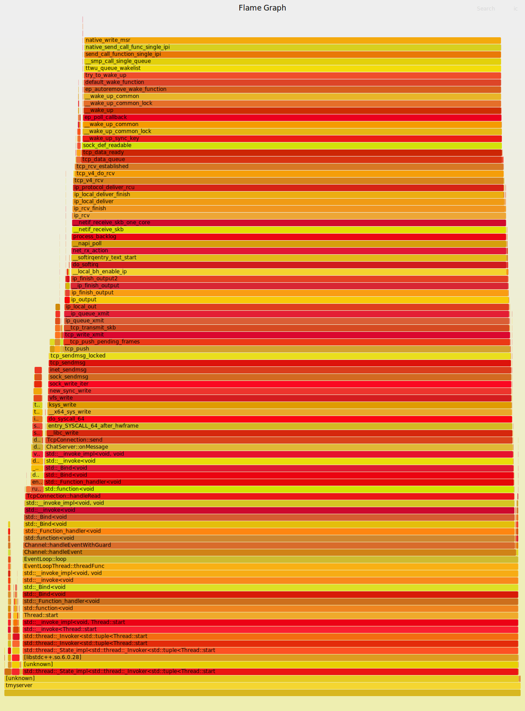

# Muduo网络库 C++11重构  
此项目对Muduo网络库进行C++ 11重构，去除Boost依赖，并优化其中的缓冲区。
- 重写Muduo核心组件，使用C++11重构，去依赖Boost，如使用std::function<> 替代boost::function。
- 添加定时器任务组件，选用gettimeofday + timerfd_*函数作为事件产生器，使得定时任务能够用Reactor模式管理，统一了事件源，代码一致性更好。

# 运行
```shell
git clone https://github.com/mmfoxred/mmuduo.git
cd mmuduo/mymuduo
sudo ./install.sh
# 在./build中生成libmymuduo.so
# 将头文件复制到 /usr/include/mymuduo
# 将库文件复制到 /usr/lib/mymuduo/
```
现在在项目中包含头文件即可，编译时添加 `-lmymuduo -lpthread` 参数

# 性能分析及优化
## 性能分析
使用`pref + FlameGraph脚本` 针对特定的测试程序（`Ping-Pong测试程序`）生成On-CPU火焰图，并分析其性能瓶颈。

- 先看底部，只有系统调用 + 主功能，没有什么可优化的地方
- 继续往上看，这里有一个分叉点。分别是`可读事件的处理函数handleRead`和`readFd`读取fd内的数据到缓冲区。
    - `readFd`中使用了`readv`和`muduo独特的缓冲区put方法`。
    - put方法中根据读取的字节数决定是使用缓冲区挪移或者vector<char>的内存扩容，这确实会造成一定的开销。
- 继续往上看，这里是`Buffer::retrieveAllAsString 截取缓冲区中内容，返回string`和`send函数`。这里的开销是无法避免的。
- 再上面就是socket的send过程，涉及Linux的网络协议栈，水平有限就不再分析了。可以看到经过传输层TCP、网络层IP。
- 该测试程序（网络库）其实还是大部分消耗都是`::send()`、`::readv()`和其他系统调用的开销。

## 性能优化
从上方的火焰图可以知道，Muduo库使用的Buffer是一个优化点。主要是其内部使用vector<char>动态扩容和缓冲区腾挪造成的消耗，vector<char>扩容开销在这里的测试中`并不突出`，因为测试程序使用固定的BuffSize，vector扩容到足够大小后就不会再触发扩容机制了，而是腾挪。  

所以主要考虑减少其腾挪内存的开销，这里借鉴kfifo的思想，read、write记录只增不减，不取余、不腾挪。
# PingPong性能测试
与原muduo库测试方式一致并使用配套的脚本测试。[脚本地址](https://github.com/dongyusheng/csdn-code/tree/master/muduo/examples/pingpong)


整体吞吐量性能提升 7%